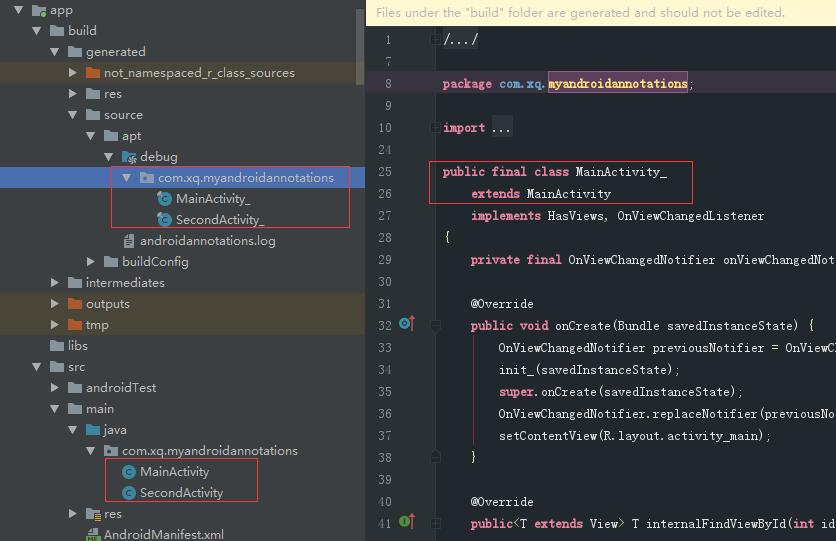
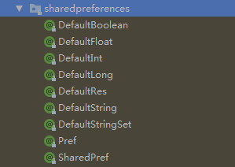
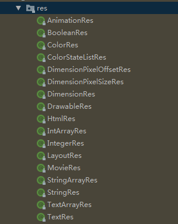

# 配置

参考： 

[官网 ： build.gradle](https://github.com/androidannotations/androidannotations/blob/develop/examples/RoboGuiceExample/build.gradle)

[关于androidannotations（注解）的理解和使用（文档篇）](https://blog.csdn.net/baisemaque/article/details/50766639)

[AndroidAnnotations框架的配置及标签介绍](https://blog.csdn.net/qq_26446715/article/details/79789119)

# 常见的几个注解使用

>@EActivity
@Click
@ViewById
@Extra
@AfterViews

```
//这是最为基本的一个注解，表示该类是一个Activity，并且对应于哪个布局文件
@EActivity(R.layout.activity_main)
public class MainActivity extends AppCompatActivity {

    //为该按钮(R.id.btn)注册监听事件，表明该方法为该按钮的点击事件方法
    //控件的点击事件,而且如果控件ID与方法名一致,后面就不用写控件ID了.
    //该注解可以单独写,也可以对多个Button合并写
    @Click
    void btn() {
        SecondActivity.startSecondActivity(this, "我是来自第一个页面的msg");
    }
}
```

```
@EActivity(R.layout.activity_second)
public class SecondActivity extends AppCompatActivity {

    //相当于findViewById(R.id.xxx)。 声明为public不能为private
    @ViewById(R.id.tv2)
    TextView tvText;

    //获得其它地方跳转过来时所传递过来的数据，括号中的字符串即为传递过来的数据的key
    @Extra("msg")
    String msg;

    //只有所有View都注入完毕之后，才会执行该注解的方法，一般进行一些初始化的操作
    @AfterViews
    void onLoad() {
        tvText.setText(msg);
    }

    public static void startSecondActivity(Context context, String msg) {
        //注意 ： SecondActivity_ 带后缀下划线
        Intent intent = new Intent(context, SecondActivity_.class);
        intent.putExtra("msg", msg);
        context.startActivity(intent);
    }
}

```

``` 
<!-- //注意 ： MainActivity_  带后缀下划线 -->
<activity android:name=".MainActivity_">
    <intent-filter>
        <action android:name="android.intent.action.MAIN" />

        <category android:name="android.intent.category.LAUNCHER" />
    </intent-filter>
</activity>


<!-- //注意 ： SecondActivity_  带后缀下划线 -->
<activity android:name=".SecondActivity_" />
```

# @EActivity



当我们使用 @EActivity 注解activity时，会在同一个包下的另一个资源目录中生成一个在名称末尾添加了“_”的同名子类。

这个生成的子类会在注解的activity中添加一些重写的方法，如oncreate()等，并将这些方法的调用权限授权给原activity。

正是因为这个原因，我们在清单文件中注册activity时，名称后面千万不能忘记在末尾加上”_”.

通常情况下，我们start一个activity时，会调用startActivity(this,MyListActivity.class)，

这时启动的activity参数是MyListActivity，但是使用AndroidAnnotations时，

我们需要调用的activity参数应该是MyListActivity_，即startActivity(this,MyListActivity_.class)。

因为注册在manifest中注册的是下划线的activity

# 注解介绍

>view注解：
@Nullable    ：  没有返回值
@NonNull     ： 有返回值
@CheckResult ： 该注解是为了检测方法返回值是否是需要使用的
@EActivity   :   后面需要跟上一个layout id,来标示该Activity所加载的xml布局,这样原来的onCreate()方法就不用写了
@EFragment ： 注解Fragment，后面可跟上一个layout id，绑定布局
@App ： Application类的注解，在其他地方调用Application时添加
@Bean ： Bean类使用或是自定义的类时添加
@AfterViews ： 执行完oncreate后执行
@EView ：创建一个继承View的类并用@EView进行标注
@ViewById  :   与findViewById作用一致,而且@ViewById后面可以不写控件id,前提是控件变量名要与控件id一致
@Click   :   也就是控件的点击事件,而且如果控件ID与方法名一致,后面就不用写控件ID了. 该注解可以单独写,也可以对多个Button合并写
@TextChange ： 文本发生变化时的注解
@BeforeTextChange ： 文本发生变化前的注解
@AfterTextChange ： 文本发生变化后的注解
@EditorAction ： EditText被编辑时的注解

  


> 资源注解：
@StringRes  :  表示参数、变量或者函数返回值应该是一个字符串类型的资源
@ColorInt : 表示参数、变量或者函数返回值应该是一个颜色值而不是颜色资源引用，例如应该是一个 AARRGGBB 的整数值。
@ColorRes  :  表示参数、变量或者函数返回值应该是一个 color 类型的资源，而不是颜色值。注意和 ColorInt 区别
@AnimRes  :  表示参数、变量或者函数返回值应该是一个 Anim 类型的资源
@DrawableRes  :  表示参数、变量或者函数返回值应该是一个 drawable 类型的资源
@DimenRes  :  表示参数、变量或者函数返回值应该是一个 dimension 类型的资源

 

> 线程注解：
@UiThread
@MainThread
@WorkerThread
@BinderThread
其中@UiThread 和 @MainThread 在大部分的使用场景中,是可以替换使用的,如果一个类中的所有方法都在同一个线程中执行,就直接可以在类本身进行注解;

>值约束注解：
@FloatRange ：需要传的参数是一个Float或者Double类型，设置范围为0.0~1.0
@IntRange ： 对int值进行约束限定,范围限定为0~255
@Size ： ①show(@Size(max=10) String name)：字符串限制，字符串name长度最长为10
               ②show(@Size(2) int[] name)：数组元素限制，数组name元素最多为2


权限注解: 

@RequiresPermission（权限）： 在java 代码中声明权限
@RequiresPermission（anyOf = {权限,权限}）： 在java 代码中声明要其中一个权限
@RequiresPermission（allOf = {权限，权限}）： 在java 代码中声明要全部权限
